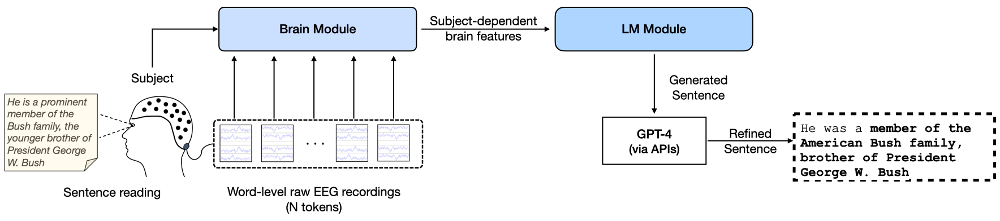
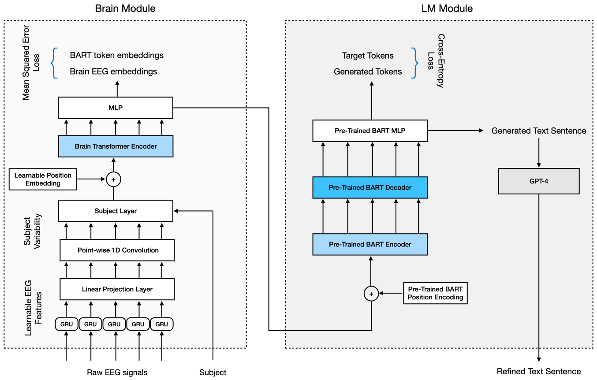

<b>Updates</b>: In light of the recent claim regarding evaluation methods by [MikeWangWZHL/EEG-To-Text#5](https://github.com/MikeWangWZHL/EEG-To-Text/issues/5), we are currently examining the issue.

---
<div align="center">
  <a href="https://github.com/hamzaamrani/EEG-to-Text-Decoding/blob/main/overview.png">
    
  </a>

  <h3 align="center">Deep Representation Learning for Open Vocabulary Electroencephalography-to-Text Decoding</h3>

  <p align="center">
    <h> <b>Hamza Amrani</b>, Daniela Micucci, Paolo Napoletano</h>
    <br />
    <a href="mailto:hamza.amrani@unimib.it">hamza.amrani@unimib.it</a>,
    <a href="mailto:daniela.micucci@unimib.it">daniela.micucci@unimib.it</a>,
    <a href="mailto:paolo.napoletano@unimib.it">paolo.napoletano@unimib.it</a>

  </p>
</div>

<div align="center">    


[](https://arxiv.org/abs/2312.09430)
<!--
ARXIV   
[](https://arxiv.org)
-->
 
</div>


<!-- ABSTRACT -->
## Abstract

Previous research has demonstrated the potential of using pre-trained language models for decoding open vocabulary Electroencephalography (EEG) signals captured through a non-invasive Brain-Computer Interface (BCI). However, the impact of embedding EEG signals in the context of language models and the effect of subjectivity, remain unexplored, leading to uncertainty about the best approach to enhance decoding performance. Additionally, current evaluation metrics used to assess decoding effectiveness are predominantly syntactic and do not provide insights into the comprehensibility of the decoded output for human understanding. We present an end-to-end deep learning framework for non-invasive brain recordings that brings modern representational learning approaches to neuroscience. Our proposal introduces the following innovations: 1) an end-to-end deep learning architecture for open vocabulary EEG decoding, incorporating a subject-dependent representation learning module for raw EEG encoding, a BART language model, and a GPT-4 sentence refinement module; 2) a more comprehensive sentence-level evaluation metric based on the BERTScore; 3) an ablation study that analyses the contributions of each module within our proposal, providing valuable insights for future research. We evaluate our approach on two publicly available datasets, ZuCo v1.0 and v2.0, comprising EEG recordings of 30 subjects engaged in natural reading tasks. Our model achieves  a  BLEU-1 score of 42.75%, a ROUGE-1-F of 33.28%,  and a BERTScore-F of 53.86%, outperforming the previous state-of-the-art methods by 3.38%, 8.43%, and 6.31%, respectively.


<!-- ARCHITECTURE -->
## Architecture
<div align="center">
  
</div>


<!-- CODE -->
## Code

This repo is based on the [EEG-to-Text](https://github.com/MikeWangWZHL/EEG-To-Text) repository.

### Download ZuCo datasets
- Download ZuCo v1.0 'Matlab files' for 'task1-SR','task2-NR','task3-TSR' from https://osf.io/q3zws/files/ under 'OSF Storage' root,  
unzip and move all `.mat` files to `/dataset/ZuCo/task1-SR/Matlab_files`,`/dataset/ZuCo/task2-NR/Matlab_files`,`/dataset/ZuCo/task3-TSR/Matlab_files` respectively.
- Download ZuCo v2.0 'Matlab files' for 'task1-NR' from https://osf.io/2urht/files/ under 'OSF Storage' root, unzip and move all `.mat` files to `/dataset/ZuCo/task2-NR-2.0/Matlab_files`.

### Preprocess datasets
run `bash ./scripts/prepare_dataset_raw.sh` to preprocess `.mat` files and prepare sentiment labels. 

For each task, all `.mat` files will be converted into one `.pickle` file stored in `/dataset/ZuCo/<task_name>/<task_name>-dataset.pickle`. 

### Usage Example
To train an EEG-To-Text decoding model, run `bash ./scripts/train_decoding_raw.sh`.

To evaluate the trained EEG-To-Text decoding model from above, run `bash ./scripts/eval_decoding_raw.sh`.


<!-- CITATION -->

## Citation

```
  @misc{amrani2023deep,
      title={Deep Representation Learning for Open Vocabulary Electroencephalography-to-Text Decoding}, 
      author={Hamza Amrani and Daniela Micucci and Paolo Napoletano},
      year={2023},
      eprint={2312.09430},
      archivePrefix={arXiv},
      primaryClass={eess.SP}
}

```

